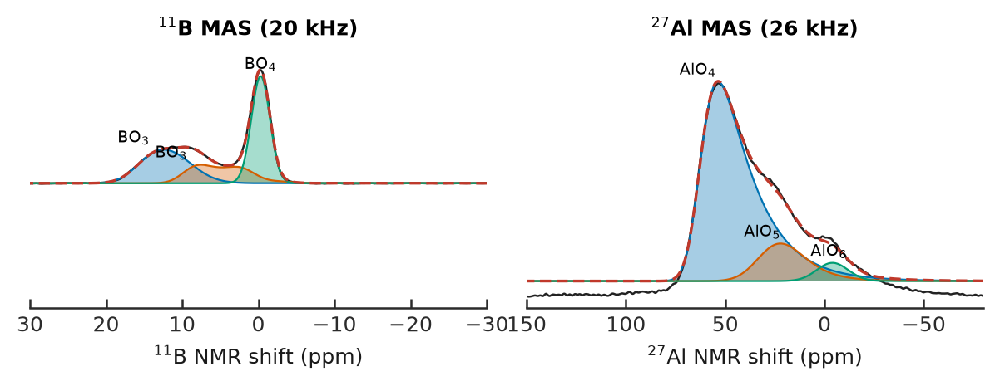

# LARMOR

LARMOR is a desktop application for fitting solid-state NMR spectra, written as an
open successor to [dmfit](https://nmr.cemhti.cnrs-orleans.fr/Dmfit/). It keeps
dmfit's fitting workflow and adds two things dmfit does not have: an uncertainty
on every fitted number, and fits that can be reproduced later from a plain text
file.

The physics comes from [mrsimulator](https://mrsimulator.readthedocs.io) and the
fitting from [lmfit](https://lmfit.github.io/lmfit-py/); LARMOR adds the interactive
fitting UI, file readers, batch workflows and figure export on top. Spectra are read
directly from instrument folders (Bruker, Varian/Agilent, legacy dmfit files); the
acquired files are never modified. A fit is saved as a JSON "recipe" that references
the data by path and hash, so it can be re-run, diffed, and shared — typically right
next to the spectrum it fits.



The figure above is rendered by LARMOR itself from the example data in
[examples/](examples/README.md) — a real ¹¹B and ²⁷Al dataset of one glass
that all the tutorials run against.

## Installation

On Windows, double-click `install.bat` in this folder. It creates the Python
environment and puts a `LARMOR.bat` launcher on your Desktop; `update.bat` updates
an existing install. Full instructions for all platforms, including the usual
troubleshooting, are in [INSTALL.md](INSTALL.md).

Manual install, from inside the repository:

```
conda env create -f environment.yml     # or: pip install -r requirements.txt
conda activate larmor
larmor desktop
```

Use Python 3.10–3.12 (3.11 recommended). On 3.13 mrsimulator currently has no
wheels and the install fails; see INSTALL.md if that happens to you.

## What it does

**Fitting.** Drag components directly on the spectrum (position, amplitude, width
handles), or edit them in a parameter table with per-parameter fix/bounds/links.
Fifteen lineshape models are available, from plain Gauss/Lorentz, Voigt and
J-multiplets through Czjzek, extended Czjzek, dmfit's "Amorphous" Gaussian
disorder, second-order quadrupolar, quad+CSA and CSA powder patterns, to external
spectra used as backgrounds. The quadrupolar models take the nucleus and field
from the data, so there is nothing special to do for a new isotope. Fit windows
can be a union of regions, dmfit-style, and a multi-start "Auto fit" helps with
awkward starting points.

**Uncertainties.** Every fit reports errors, three ways: from the covariance
matrix, by Monte-Carlo resampling, or from χ² profiling (proper 1σ/2σ confidence
intervals). The latter two run on all CPU cores. Parameters that finish pinned at
a bound are flagged rather than reported with a meaningless error bar, and the fit
warns when two parameters are so correlated the data cannot separate them.

**Series of spectra.** A batch fit applies one shared model to many spectra at
once, with amplitudes free per spectrum and any parameter optionally "released"
to drift between samples; components can be excluded per sample. A sequential fit
walks a composition or temperature series, each spectrum starting from its
neighbour's result. Multi-field datasets can be fit simultaneously, which is often
the only way to separate Cq from δiso. Results export to a long-format CSV with
errors and populations.

**2D and MQMAS.** Interactive 2D fitting (click to place a site, the fitted model
drawn as contours over the data), hypercomplex phasing, shearing, and contour
figures with projections and computed CS/QIS reference lines.

**Processing.** The usual TopSpin/ssNake operations: apodization windows,
zero-filling, Fourier transform, phasing (manual or automatic), baseline
correction, linear prediction, Hilbert reconstruction, whole-echo processing,
region extraction, spectrum algebra and alignment. Processing steps are stored in
the recipe and replayed whenever the data is reloaded.

**Relaxation and dipolar experiments.** T1/T2 extraction from arrayed experiments
(saturation/inversion recovery, CPMG, T1ρ), including per-site decomposition;
REDOR curves to dipolar couplings and distances; QCPMG echo trains to spikelet or
sum-echo spectra with a guided, step-by-step processing dialog.

**Figures.** A plotting studio produces publication figures (overlays, stacked
plots, deconvolution grids from a batch fit, species distributions, relaxation
series) from a JSON spec that can be saved and re-rendered identically. Journal
style presets, PNG/SVG/PDF output.

**Other.** DFT tensor import from CASTEP/Quantum ESPRESSO `.magres` files, an
optional bridge to SIMPSON for exact recoupling simulations, and a `larmor` CLI
(`info`, `import`, `fit`, `batchfit`, `seqfit`, `multifit`, `satrec`, `redor`,
`magres`) for scripted use — the whole thing is an ordinary Python package
underneath.

## How it compares to dmfit

dmfit is the reference point throughout, and LARMOR reads its `.fxml`/`.fxmla`
fit files directly. The practical differences: uncertainties are computed for
everything rather than being a separate tool, fits are plain JSON instead of an
opaque format, batch and series fitting are built in, everything is scriptable
from Python, and it runs on any platform. If you have years of dmfit fits, they
import — that was one of the design goals, and 20 fits from a published
¹¹B study import with no warnings and match the paper's parameters to its own
rounding ([validation report, §5.7](docs/validation.md)).

## Validation

A fitting program should not be trusted on faith. The physics is checked
against analytic theory, direct ensemble simulations, and real published
data: see [docs/validation.md](docs/validation.md). The figures in that report
are generated by a script in the repo, not drawn. The test suite (about 600
tests, `pytest tests/`) guards the physics constants and conventions and, on
machines that have them, fits real Bruker datasets; the published-paper
reproductions above are documented in the validation report.

## Status

The desktop app is the primary interface and where all development happens.
About 30k lines of Python, of which the fitting core is Qt-free and usable as a
library. Known gaps are tracked in [docs/roadmap.md](docs/roadmap.md) — the
honest summary is that the code is well tested but there is no CI or signed
release pipeline yet, so installing from source is the reliable route. A FastAPI
web variant exists in the tree but is unmaintained; don't use it.

Tutorials live in [docs/tutorials/](docs/tutorials/). Raw instrument data is
never committed to this repository and never written to — `data/` holds only
notes about where data lives.

## License

MIT. If you use LARMOR in published work, a citation of the repository is
appreciated, alongside dmfit (Massiot et al., *Magn. Reson. Chem.* 2002) whose
design this follows and mrsimulator which does the quantum mechanics.

Sam Soudani — McCloy group, Washington State University.
