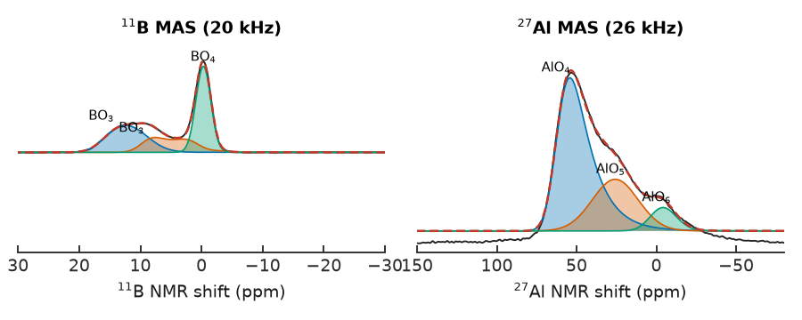

# LARMOR

LARMOR is a desktop application for fitting solid-state NMR spectra, written as an
open successor to [dmfit](https://nmr.cemhti.cnrs-orleans.fr/Dmfit/). It keeps
dmfit's fitting workflow and adds two things dmfit does not have: an uncertainty
on every fitted number, and fits that can be reproduced later from a plain text
file.

The physics comes from [mrsimulator](https://mrsimulator.readthedocs.io) and the
fitting from [lmfit](https://lmfit.github.io/lmfit-py/); LARMOR adds the interactive
fitting UI, file readers, batch workflows and figure export on top. Spectra are read
directly from instrument folders (Bruker, Varian/Agilent, legacy dmfit files); the
acquired files are never modified. A fit is saved as a JSON "recipe" that references
the data by path and hash, together with the acquisition parameters read from the
instrument files and the software versions that produced the fit, so it can be
re-run, diffed, and shared — typically right next to the spectrum it fits — and the
Experimental paragraph and Table S1 of a paper come out of the same file as the fit.



The figure above is rendered by LARMOR itself from the example data in
[examples/](examples/README.md) — a real ¹¹B and ²⁷Al dataset of one glass
that Tutorials 1–3, 5 and 6 run against. Tutorials 4 and 7 walk through a
composition series and a static wideline dataset that are described but
not shipped.

## Installation

**Windows, no Python needed.** Download `LARMOR-<version>-setup.exe` (or the
`-win64.zip`) from the Releases page and run it: it installs for your own
account (no administrator rights), adds LARMOR to the Start menu and registers
an uninstaller under Settings ▸ Apps. The build is not code-signed, so Windows
SmartScreen says "unknown publisher" — choose *More info ▸ Run anyway*. The
installed folder carries `INSTALL.txt` with the first steps and the two
self-checks (`LARMOR.exe --selftest`, `LARMOR.exe --distcheck`) to run if
anything misbehaves. A ¹¹B / ²⁷Al example data set ships inside it
(`_internal\examples\pCABS2-4`), so the tutorials can be followed without data
of your own.

**From source** (Windows, macOS, Linux). On Windows, double-click `install.bat`
in this folder: it creates the Python environment and puts a `LARMOR.bat`
launcher on your Desktop; `update.bat` updates an existing install. Full
instructions for all platforms, including the usual troubleshooting, are in
[INSTALL.md](INSTALL.md).

Manual install, from inside the repository:

```
conda env create -f environment.yml     # or: pip install -r requirements.txt
conda activate larmor
larmor desktop
```

Use Python 3.10–3.12 (3.11 recommended). On 3.13 mrsimulator currently has no
wheels and the install fails; see INSTALL.md if that happens to you.

## What it does

**Fitting.** Drag components directly on the spectrum (position, amplitude, width
handles), or edit them in a parameter table with per-parameter fix/bounds/links.
Eighteen lineshape models are available, from plain Gauss/Lorentz, Voigt and
J-multiplets through Czjzek (also with a free dimensionality d), a correlated
shift–C_Q Czjzek, extended Czjzek, dmfit's "Amorphous" Gaussian disorder,
second-order quadrupolar, quad+CSA and CSA powder patterns, two-site chemical
exchange, to external spectra used as backgrounds. The quadrupolar models take the nucleus and field
from the data, so there is nothing special to do for a new isotope. Fit windows
can be a union of regions, dmfit-style, and a multi-start "Auto fit" helps with
awkward starting points. Spinning-sideband manifolds are detected from the data
itself — the repeat at ±νrot, tolerant to a recorded rate off by 2 % — and
offered as a linked manifold or a shifted copy of the spectrum in one click.

**Uncertainties.** Every fit reports errors, three ways: from the covariance
matrix, by Monte-Carlo resampling, or from χ² profiling (proper 1σ/2σ confidence
intervals). The latter two run on all CPU cores. Parameters that finish pinned at
a bound are flagged rather than reported with a meaningless error bar, and the fit
warns when two parameters are so correlated the data cannot separate them. Every
such flag — unphysical values, degenerate pairs, a structured residual,
parameters at bounds, a missing covariance, unsupported populations — is
gathered into one always-visible fit-health strip under the spectrum, each
chip opening its detail.

**Series of spectra.** A batch fit applies one shared model to many spectra at
once, with amplitudes free per spectrum and any parameter optionally "released"
to drift between samples; components can be excluded per sample. A series mode
walks a composition or temperature series spectrum by spectrum in the main
window: a spectrum without lines takes a copy of its neighbour's model, a fitted
one is never overwritten unless you seed it explicitly, a "Keep this fit" lock
protects finished members, components are paired by their label, and an auto
sweep fits the whole series in forward and backward passes. Multi-field datasets can be fit simultaneously, which is often
the only way to separate Cq from δiso. Results export to a long-format CSV with
errors and populations, and with each value's status — fixed, linked or
finished at a bound — so a table never presents a held value as a fitted one.

**2D and MQMAS.** Interactive 2D fitting (click to place a site, the fitted model
drawn as contours over the data), hypercomplex phasing, shearing, and contour
figures with projections and computed CS/QIS reference lines.

**Processing.** The usual TopSpin/ssNake operations: apodization windows,
zero-filling, Fourier transform, phasing (manual or automatic), baseline
correction, linear prediction, Hilbert reconstruction, whole-echo processing,
region extraction, spectrum algebra and alignment, a time ↔ frequency toggle that
returns to the FID for re-apodization without reloading, and real / imaginary /
magnitude display channels for phasing. Processing steps are stored in the recipe
and replayed whenever the data is reloaded.

**Referencing audit.** One session folder at a time, every stored SR is compared
with the value indirect referencing from the session's ¹H adamantane spectrum
gives (IUPAC Ξ ratios, the `xiref` rule); forgotten or stale references are
listed as TopSpin-ready `sr` values, and old and new values go to a permanent
log so the correction stays reversible (`larmor srcheck`).

**Session inventory.** One month folder read into a sample × nucleus grid: the
production EXPNO of every block is pre-picked by the operator's rule (the
highest EXPNO with a `pdata/1/1r`, demoted when its NS is a small fraction of
the block's maximum or its title says power check / test / failed), sample
names come from the folder convention rather than the title's pulse note,
titles whose rotor ID or sample contradict their folder are flagged, and one
action hands the picks to Batch fit (`larmor inventory`).

**Before and after a series fit.** A comparability check reads every member's
acqus, procs and TopSpin command trail and flags what differs from the series
majority (line broadening, TDeff, recycle delay…), with a one-click reprocess
of all members from their fids through one common chain (`larmor compare`).
A series table names, groups and orders the spectra and joins composition
columns from a CSV, so the series plot can run against a real x axis with
replicate averaging and a fitted line. Lines can be tagged with a structural
family (BO₃/BO₄, Al[4]/Al[5]/Al[6], Qⁿ…) to report summed populations and named
ratios such as N₄ with errors propagated on a stated basis. Every table marks
held (†), at-bound (‡) and linked (§) parameters, the fit-health strip judges
the recycle delay and flip angle against a sibling T₁ measurement, and the MAS
rate is taken by majority from the acqus, the title and the booking sidecar.

**Relaxation and dipolar experiments.** T1/T2 extraction from arrayed experiments
(saturation/inversion recovery, CPMG, T1ρ), including per-site decomposition;
REDOR curves to dipolar couplings and distances; QCPMG echo trains to spikelet or
sum-echo spectra with a guided, step-by-step processing dialog.

**Figures.** A plotting studio produces publication figures (overlays, stacked
plots, deconvolution grids from a batch fit, species distributions, relaxation
series) from a JSON spec that can be saved and re-rendered identically. Journal
style presets, PNG/SVG/PDF output.

**Other.** DFT tensor import from CASTEP/Quantum ESPRESSO `.magres` files
(spin-aware seeding, symmetry-equivalent atoms merged per crystallographic
site, a multi-reference shielding-to-shift calibration line with covariance),
a command palette (Ctrl+Shift+P) that reaches any menu entry by fuzzy search,
an optional bridge to SIMPSON for exact recoupling simulations, and a `larmor`
CLI (`info`, `import`, `fit`, `batchfit`, `seqfit`, `multifit`, `satrec`,
`redor`, `magres`, `shiftcal`) for scripted use — the whole thing is an
ordinary Python package underneath.

## How it compares to dmfit

dmfit is the reference point throughout, and LARMOR reads its `.fxml`/`.fxmla`
fit files directly. The practical differences: uncertainties are computed for
everything rather than being a separate tool, fits are plain JSON instead of an
opaque format, batch and series fitting are built in, everything is scriptable
from Python, and it runs on any platform. If you have years of dmfit fits, they
import — that was one of the design goals, and 20 fits from a published
¹¹B study import with no warnings and match the paper's parameters to its own
rounding ([validation report, §5.7](docs/validation.md)).

## Validation

A fitting program should not be trusted on faith. The physics is checked
against analytic theory, direct ensemble simulations, and real published
data: see [docs/validation.md](docs/validation.md). The figures in that report
are generated by a script in the repo, not drawn. The test suite (about 1800
tests, `pytest tests/`) guards the physics constants and conventions and, on
machines that have them, fits real Bruker datasets; the published-paper
reproductions above are documented in the validation report. The Windows build
checks itself: `LARMOR.exe --distcheck` imports every module the program can
reach, opens every bundled resource, runs every engine, export format, the
process pool and the command line, and with `--gui` every window and menu
action, inside the installed copy.

## Status

The desktop app is the primary interface and where all development happens.
About 70k lines of Python, of which the fitting core is Qt-free and usable as a
library. Known gaps are tracked in [docs/roadmap.md](docs/roadmap.md). The
Windows builds come from `packaging/build.bat` (PyInstaller + Inno Setup) and
are not code-signed; there is no CI yet. A FastAPI web variant exists in the
tree (`larmor app`) but is unmaintained and is not part of the Windows build.

Anyone modifying the code should start with
[docs/development-notes.md](docs/development-notes.md): the conventions the
numbers depend on, the validation anchors a change must not break, and an
index of the bugs already fixed here. [docs/architecture.md](docs/architecture.md)
maps the modules.

Tutorials live in [docs/tutorials/](docs/tutorials/):

1. [A first fit — ²⁷Al Czjzek](docs/tutorials/01-first-fit-27Al-czjzek.md)
2. [Constraints — fix, bound, link](docs/tutorials/02-constraints.md)
3. [Plotting studio figures](docs/tutorials/03-figures.md)
4. [Batch fitting a composition series](docs/tutorials/04-batch-fitting.md)
5. [MQMAS — 2D processing and fitting](docs/tutorials/05-mqmas.md)
6. [Error analysis — covariance, Monte-Carlo, χ² profile](docs/tutorials/06-error-analysis.md)
7. [Static wideline — ⁸¹Br WURST-CPMG](docs/tutorials/07-static-81Br-wcpmg.md)

They are also reachable in the app under Help ▸ Tutorials. Raw instrument
data is never committed to this repository and never written to — `data/`
holds only notes about where data lives.

## License

MIT. If you use LARMOR in published work, a citation of the repository is
appreciated, alongside dmfit (Massiot et al., *Magn. Reson. Chem.* 2002) whose
design this follows and mrsimulator which does the quantum mechanics.

LARMOR itself is MIT. The graphical interface uses Qt 6 through PySide6 and
shiboken6 (© The Qt Company), used under the GNU Lesser General Public License
v3 (LGPL-3.0). In the Windows build the Qt libraries ship unmodified as
separate DLLs under `_internal\PySide6` and can be replaced with another build
of the same Qt major version. The full third-party list with every licence
text the wheels carry is `THIRD_PARTY_LICENSES.txt` next to `LARMOR.exe`
(`packaging/THIRD_PARTY_LICENSES.txt` here), and the LGPL-3.0 / GPL-3.0 texts
are in `LICENSES\`; PySide6 licensing: https://doc.qt.io/qtforpython-6/licenses.html,
source: https://code.qt.io/cgit/pyside/pyside-setup.git.

LARMOR works offline and sends nothing anywhere. The one exception is
Help ▸ More…, a just-for-fun card that fetches a picture from a public image
service when you open it.

## Acknowledgements

LARMOR is developed by Sam Soudani in the Nuclear, Optical, Magnetic, and
Electronic Materials Laboratory (NOME) of Prof. John McCloy, School of
Mechanical and Materials Engineering, Washington State University, with
support from the U.S. Department of Energy (DOE).
