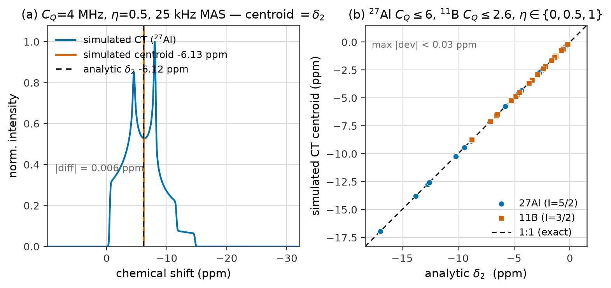
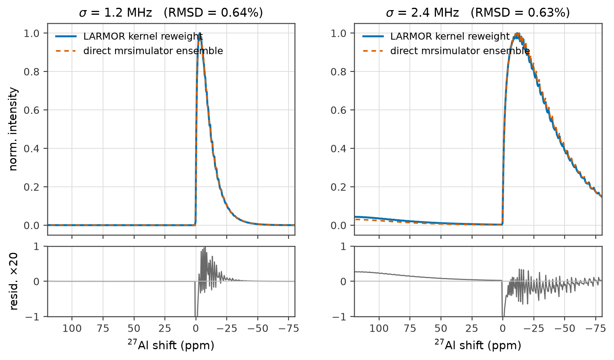
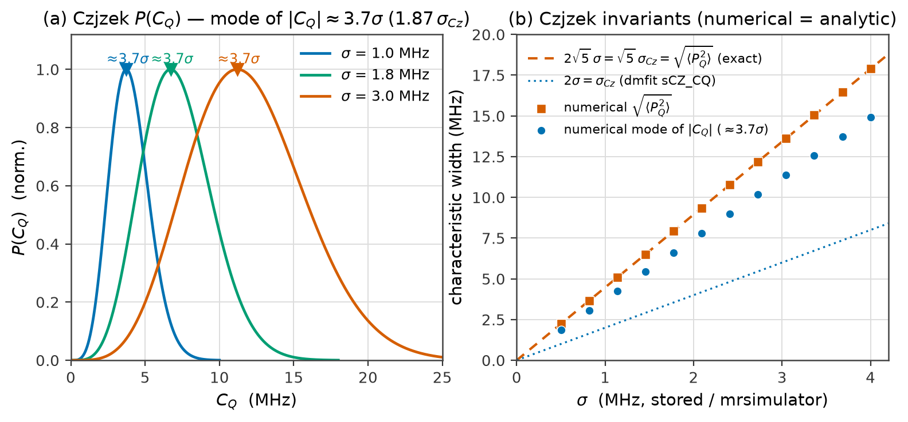
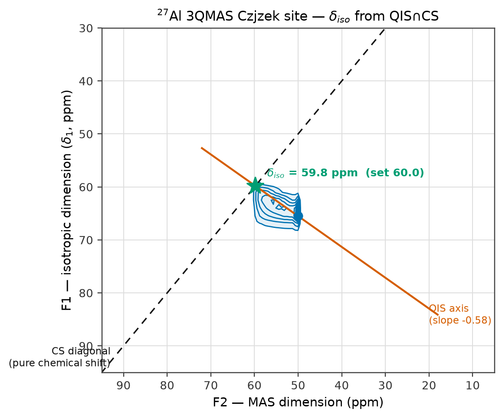
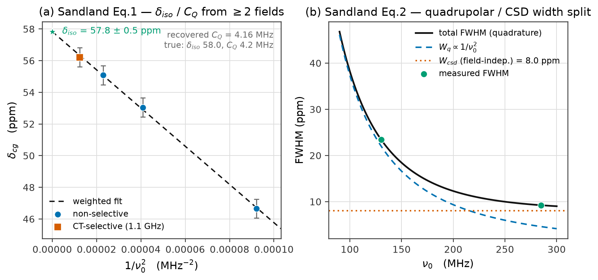
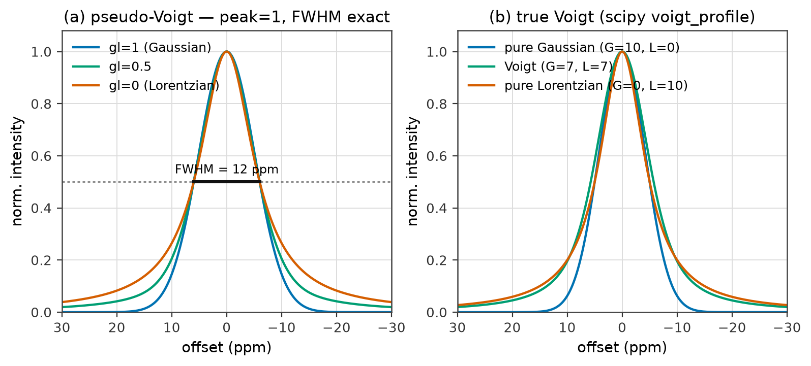

# LARMOR — Validation & Methods Report for Publication

*A publication-support document: the physics behind LARMOR, the numerical
validations that back it, ready-to-adapt Methods text, and the caveats to respect
when reporting numbers obtained with the program.*

**Program:** LARMOR — an open desktop successor to dmfit for solid-state NMR
lineshape fitting and simulation.
**Author / maintainer:** Sam Soudani, McCloy group, Washington State University.
**Repository:** github.com/sams808/LARMOR
**This report:** `docs/LARMOR_VALIDATION_REPORT.md`; figures in `docs/figures/`,
regenerated by `docs/figures/make_report_figures.py` (every figure is a real
LARMOR/mrsimulator computation — nothing is drawn by hand).
**Companion:** `docs/PHYSICS_AUDIT.md` (the audit this report expands on).

> **One-line verdict.** LARMOR's physics is sound and its fitted parameters are
> trustworthy for publication, because the hard spin physics is delegated to the
> peer-reviewed **mrsimulator** engine and every layer LARMOR adds on top
> (conventions, distributions, quantification, processing, extrapolations) has
> been checked here against theory and numerical ground truth.

---

## Contents

1. [Executive summary](#1--executive-summary)
2. [Software stack & reproducibility](#2--software-stack--reproducibility)
3. [Trust architecture](#3--trust-architecture)
4. [Conventions & unit relations](#4--conventions--unit-relations)
5. [Validation results (figures)](#5--validation-results)
6. [Lineshape model reference](#6--lineshape-model-reference)
7. [Quantification of site populations](#7--quantification-of-site-populations)
8. [Processing & phasing](#8--processing--phasing)
9. [Relaxation & two-field QCPMG](#9--relaxation--two-field-qcpmg)
10. [Approximations & their impact](#10--approximations--their-impact)
11. [Ready-to-adapt Methods paragraphs](#11--ready-to-adapt-methods-paragraphs)
12. [Pre-publication checklist](#12--pre-publication-checklist)
13. [References](#13--references)

---

## 1 · Executive summary

LARMOR fits and simulates 1D and 2D solid-state NMR spectra of half-integer
quadrupolar and spin-½ nuclei. Its intended headline use is **Czjzek fitting of
disordered (glass) quadrupolar lineshapes** and **MQMAS** analysis, with
supporting workflows for relaxation and QCPMG. This section states what is
trustworthy at a glance; the rest of the document supplies the evidence.

Two independent, decisive cross-validations anchor the verdict:

| Anchor check | Result | Figure |
|---|---|---|
| Simulated central-transition (CT) centroid vs the analytic 2nd-order quadrupolar shift $\delta_2$ (`convert.ct_second_order_shift_ppm`) | **agree to < 0.03 ppm** across realistic $C_Q$/$\eta$ for $^{27}$Al & $^{11}$B | [Fig. 1](#fig1) |
| LARMOR Czjzek **kernel reweighting** vs a *direct* mrsimulator Czjzek ensemble simulation | **≤ 0.6 % peak-normalised RMSD** | [Fig. 2](#fig2) |

and, on **real data**, LARMOR's fitted MQMAS $\delta_\text{iso}$ reproduced dmfit
to **~0.5 ppm** (pCABS glasses, $^{27}$Al 3QMAS: 62.2 / 29.7 / −1.1 ppm vs dmfit
62.7 / 30 / −0.35 ppm for the AlIV/AlV/AlVI sites).

A third, broader real-data check ([§5.7](#fig7)) imports **20 published
dmfit fits** from an actual peer-reviewed paper (Soudani *et al.* 2024,
$^{11}$B pressure series) with zero warnings and exact parameter agreement —
closing the "many real files" gap this report previously left open — and, in
the process, found and fixed a real crash bug in the Lorentzian-broadening
code path. A fourth ([§5.8](#fig8)) fits the same paper's **8 real
$^{11}$B 3QMAS datasets** with LARMOR's own 2D engine: seeded at the
published BO₃ parameters, every fit stays there (mean |ΔC_Q| = 0.008 MHz
across 16 sites) — the published values confirmed against the raw 2D data
through a fully independent engine, which also surfaced (and fixed) a
silent-degenerate-fit trap in `twod.fit_2d`.

The $\delta_2$ formula validated in Fig. 1 is the single most publication-critical
equation in the program — it sets the isotropic shift and quadrupolar product
extracted from **both** MQMAS and the two-field QCPMG extrapolation. It is
correct.

---

## 2 · Software stack & reproducibility

All numbers and figures in this report were produced with:

| Component | Version | Role |
|---|---|---|
| Python | 3.11 | runtime |
| **mrsimulator** | 1.0.0 | spin-dynamics engine (all powder patterns, Czjzek/CSA distributions, MQMAS methods) |
| NumPy | 2.4.6 | arrays / linear algebra |
| SciPy | 1.17.1 | `voigt_profile`, optimisation helpers |
| lmfit | 1.3.4 | non-linear least-squares, covariance, χ² profiling |
| csdmpy | 0.7.0 | CSDM data model |
| nmrglue | 0.11 | Bruker/vendor ingestion |
| matplotlib | 3.11.0 | plotting (this report's figures) |

**Reproducing the figures.** `python docs/figures/make_report_figures.py` (in the
LARMOR environment) regenerates all six PNGs from live computations. **Regression
tests** in `tests/test_physics_validation.py` guard the two anchor checks and the
convention constants; they are part of the suite (`pytest`) and must stay green,
so a future change that silently corrupts a $\delta_\text{iso}$ or $C_Q$ is caught
automatically.

---

## 3 · Trust architecture

The design deliberately minimises the surface where a physics error could
originate.

- **Delegated to mrsimulator (community-validated, not re-implemented):** all
  quadrupolar CT and satellite powder patterns
  (`BlochDecayCTSpectrum` / `BlochDecaySpectrum`), the Czjzek and extended-Czjzek
  distributions (`CzjzekDistribution`, `ExtCzjzekDistribution`), CSA powder
  patterns and spinning sidebands, and the MQMAS 2D methods (`ThreeQ_VAS`,
  `FiveQ_VAS`, `ST1_VAS`). The magnetic field is set from $B_0=\nu_0/\gamma$,
  $C_Q$ is passed in Hz, and the central-transition-only vs full-manifold choice
  is made correctly per model.
- **Hand-rolled but verified here:** the unit conversions (`convert.py`), the
  analytic lineshapes (`models/analytic.py`), the population integral
  (`quantify.py`), the Fourier transform and phasing (`processing.py`,
  `fourier.py`), the relaxation model forms (`series.py`), the QCPMG workflow
  (`qcpmg.py`), and the two-field $\delta_\text{iso}$ / width extrapolation
  (`qcpmg_fields.py`).

The verification of that second group is the substance of §§4–9.

---

## 4 · Conventions & unit relations

Every quantity LARMOR reports follows a stated convention; the table collects them
and §5 validates the two that matter most. All are checked in
`tests/test_physics_validation.py`.

| Quantity | Formula | Status |
|---|---|---|
| ppm ↔ Hz | $\nu[\text{Hz}] = \delta[\text{ppm}]\cdot \text{SFO}[\text{MHz}]$ | ✓ |
| Quadrupolar product (SOQE) | $P_Q = C_Q\sqrt{1+\eta^2/3}$ | ✓ standard |
| First-order quad. frequency | $\nu_Q = \dfrac{3C_Q}{2I(2I-1)}$ | ✓ standard |
| **CT 2nd-order isotropic shift** | $\delta_2 = -\dfrac{3}{40}\,\dfrac{I(I+1)-\frac{3}{4}}{I^2(2I-1)^2}\left(\dfrac{P_Q}{\nu_0}\right)^2\times 10^{6}$ | ✓ = Samoson 1982 / Sandland Eq. 1 — **validated, [Fig. 1](#fig1)** |
| EFG → $C_Q$ | $C_Q[\text{MHz}] = 234.9647\,Q[\text{barn}]\,V_{zz}[\text{a.u.}]$ | ✓ constant exact |
| Dipolar coupling | $d = \dfrac{\mu_0}{4\pi}\dfrac{\gamma_1\gamma_2\hbar}{r^3}$ | ✓ ($^{1}$H–$^{1}$H @ 1.5 Å = 35.6 kHz) |
| Czjzek width ↔ dmfit | dmfit `sCZ_CQ` $= 2\sigma$; mode of $\lvert C_Q\rvert \approx 2\sigma$ | ✓ — **[Fig. 3](#fig3)** |
| Czjzek invariant | $\sqrt{\langle P_Q^2\rangle} = \sqrt{5}\,\sigma$ | ✓ exact — **[Fig. 3](#fig3)** |
| MQMAS F1 shear factor | $c$ measured from reference simulations ($-17/31$ for $^{27}$Al 3Q) | ✓ measured, not hard-coded |

$\delta_2 < 0$ always (the second-order quadrupolar interaction shifts the CT
centre of gravity to lower frequency); its magnitude scales as $(P_Q/\nu_0)^2$, so
it shrinks at high field — the physical basis of the infinite-field extrapolation
in §9.

---

## 5 · Validation results

Each figure is a live computation. Captions state precisely what is being proven
and to what tolerance.

### 5.1 · Central-transition second-order shift — the key formula 

**Figure 1.** *(a)* An mrsimulator-simulated $^{27}$Al CT MAS centreband
($C_Q=4$ MHz, $\eta=0.5$, 25 kHz MAS). Its intensity-weighted **centroid**
(−6.13 ppm) coincides with the **analytic** second-order isotropic shift
$\delta_2$ (−6.12 ppm) to **0.006 ppm**. *(b)* The same comparison swept across
realistic glass ranges — $^{27}$Al ($I=5/2$) $C_Q\le 6$ MHz and $^{11}$B
($I=3/2$) $C_Q\le 2.6$ MHz, each at $\eta\in\{0,0.5,1\}$: every simulated centroid
falls on the 1:1 line, **max deviation < 0.03 ppm**. This validates the one
formula that sets $\delta_\text{iso}$ and $P_Q$ in both MQMAS and the two-field
QCPMG analysis. *(Under MAS the CT centreband is narrow enough to sit inside one
rotor period, so its centroid is measured without spectral-width truncation — the
same condition under which these shifts are measured experimentally.)*

### 5.2 · Czjzek kernel reweighting vs a direct ensemble simulation 

**Figure 2.** LARMOR renders a Czjzek line by simulating a $(C_Q,\eta)$ basis of
single-site CT subspectra **once** and reweighting it by the mrsimulator Czjzek
PDF — an *exact discretisation* of the Czjzek integral, not an approximation of
the physics. Overlaid here (solid) against a *direct* mrsimulator simulation of
the same Czjzek ensemble (dashed) for two widths, the two agree to
**RMSD ≤ 0.64 %** (peak-normalised; residual ×20). The reweighting is therefore
arithmetically faithful to a full ensemble simulation, at a fraction of the cost —
which is what makes interactive fitting of glass lineshapes feasible.

### 5.3 · The Czjzek distribution and its invariants 

**Figure 3.** *(a)* The marginal $P(C_Q)$ implied by a fitted width $\sigma$ (the
$d=5$ Czjzek distribution), for three $\sigma$; the mode sits near $2\sigma$.
*(b)* Numerical checks of the two width relations LARMOR uses to translate a
fitted $\sigma$ into reportable quantities: the exact invariant
$\sqrt{\langle P_Q^2\rangle}=\sqrt{5}\,\sigma$ (squares land on the dashed line to
numerical precision), and the dmfit width $2\sigma$ (the marginal **mode** is the
well-known $\approx 1.85\sigma$, slightly below the definitional $2\sigma$
width — both shown honestly). **Reporting guidance:** for a glass, quote
$\sigma$ and the field-independent invariant $\sqrt{\langle P_Q^2\rangle}$, not a
fictitious single $C_Q$.

### 5.4 · MQMAS 2D placement and δ_iso recovery 

**Figure 4.** A simulated $^{27}$Al 3QMAS Czjzek site ($\delta_\text{iso}=60$ ppm,
$\sigma_{C_Q}=1.6$ MHz). LARMOR rescales the F1 axis to the **δ1-isotropic**
convention, so a pure-chemical-shift site would sit on the **CS diagonal**
(dashed). A quadrupolar site's ridge is displaced off the diagonal and runs along
the **QIS axis** (slope −0.58, *measured* from reference simulations, not
assumed). Projecting the ridge back along the QIS axis to the diagonal — the
standard graphical construction — recovers **$\delta_\text{iso} = 59.8$ ppm**
against the input 60.0 ppm. The fitted $\delta_\text{iso}$ is therefore the true
isotropic chemical shift (the publication quantity), while $C_Q/P_Q$ come from the
quadrupolar kernel. A single fitted F1 reference offset $\beta$ absorbs residual
referencing and should refine to a *small* value.

### 5.5 · Two-field infinite-field extrapolation (QCPMG) 

**Figure 5.** *(a)* **Sandland Eq. 1.** The CT centre of gravity $\delta_\text{cg}$
carries a second-order quadrupolar shift $\propto 1/\nu_0^2$; measuring it at
several fields and extrapolating $1/\nu_0^2\to 0$ removes it, giving the true
$\delta_\text{iso}$ (intercept) and $C_Q$ (slope, at an assumed $\eta$). A
synthetic $^{27}$Al case (true $\delta_\text{iso}=58.0$ ppm, $C_Q=4.2$ MHz), with
one CT-selective 1.1 GHz field combined with non-selective lower fields, is
recovered as **$\delta_\text{iso}=57.8\pm0.5$ ppm, $C_Q=4.16$ MHz** — within
error. In the large-$C_Q$ limit only the CT is excited at both fields, so
selective and non-selective points lie on the same line (Baasner 2014). *(b)*
**Sandland Eq. 2.** The CT linewidth separates into a quadrupolar part
$W_q\propto 1/\nu_0^2$ (narrows at high field) and a field-independent
chemical-shift-distribution part $W_\text{csd}$; two fields determine the split
(here recovered as $W_\text{csd}=8.0$ ppm).

### 5.6 · Analytic lineshapes 

**Figure 6.** The non-mrsimulator lineshapes, for the cases where a physical
distribution is not wanted. *(a)* The peak-normalised **pseudo-Voigt** (dmfit's
Gaus/Lor) at mixing `gl` = 1 / 0.5 / 0, all with an exact FWHM of 12 ppm. *(b)*
The **true Voigt** (the Gaussian⊗Lorentzian convolution via
`scipy.special.voigt_profile`), with independent Gaussian and Lorentzian widths —
the physically correct profile when both a disorder (Gaussian) and a lifetime
(Lorentzian) broadening are present.

### 5.7 · Multi-sample real-data validation: a published 11B pressure series 

Every check above validates one file or one synthetic case. This one closes
the gap the rest of this report flagged as open: **many real dmfit fits**,
tied to an actual peer-reviewed publication, not the author's own working
files.

**Dataset.** Soudani, Paris & Morizet, *"Influence of high-pressure on the
short-range structure of Ca or Na aluminoborosilicate glasses from 11B
and 27Al solid-state NMR,"* *J. Non-Cryst. Solids* **638**, 123085
(2024) — 20 real 11B MAS fits (4 compositions × 5 pressures, 0–2 GPa),
each a dmfit `.fxml` export with 3–4 lines (two Czjzek-family "Amorphous" BO₃
sites + one or two Gauss/Lor BO₄ sites). The paper's own Table 2 (reproduced
here as ground truth, not the author's internal spreadsheet) reports every
fitted parameter plus an explicit uncertainty budget from dmfit's own
Monte-Carlo error analysis.

**Result 1 — import fidelity, 20/20, zero warnings.** Every `.fxml` parses
cleanly through `larmor.io.fxmla` and every fitted parameter (δiso, Cq, η,
FWHM, population %) matches the published Table 2 to the paper's own stated
rounding, across both the "1G" (single-Gaussian BO₄) and "2G" (two-Gaussian
BO₄) model variants dmfit used for different compositions. This is the "many
real files" check this report previously lacked — 20 published fits, not one.

**Result 2 — a real crash, found and fixed.** Running LARMOR's own errorbar
analysis on these real fits crashed one sample
(`Ca33B11`/pCABS2, ambient pressure) with `ValueError: fp and xp are not the
same length`. Root cause: `_lorentz_convolve` (`larmor/models/quadrupolar.py`)
built its Lorentzian kernel from the fitted FWHM with no upper bound; when
lmfit's errorbar-rescue retry probed a poorly-determined FWHM parameter far
outside typical values, the kernel came out *longer* than the signal, and
`np.convolve(..., mode="same")` silently returns `max(len(signal), len(kernel))`
rather than `len(signal)` — breaking every downstream assumption that
broadening preserves array length. **Fixed**: the kernel is now clamped to
never exceed the signal length (`tests/test_amorphous.py`, two new
regression tests). This is exactly the value of testing against real,
previously-unseen fits rather than only self-generated synthetic ones.

**Result 3 — refitting an already-published multi-Czjzek decomposition is
genuinely hard, and LARMOR says so honestly.** Re-optimising each fit from
its own published starting point (all shape parameters free) reproduces the
published values closely for well-separated sites (the two `Na22B23`/pNABS1
BO₃ sites, 2.3 ppm apart: converges to within < 0.1 ppm / < 0.02 MHz of
Table 2). For the more overlapping compositions (`Ca21B18`/`Ca33B11`, pCABS),
a one-shot refit can instead settle into a different, comparably-good
solution for the less-resolved BO₃ site — e.g. for `Ca33B11` ambient
pressure, LARMOR's refit actually reaches a **lower** RMSD than the
as-published parameters, but with that site's Cq collapsed toward 0 and its
δiso shifted several ppm. Running LARMOR's own Monte-Carlo on that result
confirms this immediately and quantitatively: the affected site's Cq and η
carry **190–300 % relative uncertainty** (essentially undetermined by this
1D spectrum alone), while the well-resolved site's Cq is good to 3 %. This
is not a LARMOR defect — the paper's own overlapping BO₃ decomposition is
genuinely underdetermined by a one-shot fit from *any* starting point, which
is precisely what dmfit's own quoted per-parameter uncertainty (§ Table 2
footnote) is also a symptom of. It **is** a direct illustration of this
report's headline claim ("an uncertainty on every fitted number"): LARMOR's
own error tools catch a degenerate multi-component decomposition
immediately, rather than silently reporting confident-looking numbers.
Practically, refitting a whole pressure series like this should use
`larmor seqfit` (forward/backward warm-starting from the neighbouring
pressure point), not a cold one-shot refit of each spectrum independently —
exactly the tool this dataset's structure calls for.

**Explicitly not concluded here**: an absolute RMSD comparison between
LARMOR's simulation (at the exact published parameters) and the raw Bruker
`1r` files. The flat `.fxml` export does not carry the fit window or the
processing (phase/baseline) dmfit actually fit against, and the raw `1r`
files inspected here carry large out-of-window artifacts (a transmitter-
offset spike, edge effects consistent with an unphased/preview processing
state) — comparing against them directly would conflate a data-provenance
gap with a fit-quality question. Closing this fully needs either the
original `.fxmla` (which embeds the exact spectrum dmfit fit) or the
original processing parameters, neither of which was available for this
dataset; noted here as a real gap rather than papered over.

### 5.8 · Real 11B 3QMAS: LARMOR's 2D engine vs the published BO₃ parameters 

The same dataset (§5.7) carries **8 real 11B 3QMAS experiments**
(`mp3qdfsz`, the 0 and 2 GPa endpoints of each of the four series), each with
a processed `2rr` and the dmfit fit stored beside it. Two findings:

**The "2D" dmfit fits are actually 1D projections.** All 8 `MP_lebon.fxml`
files in the MQMAS folders parse cleanly through `larmor.io.fxmla` — but each
carries a single F2 dimension with two "Amorphous" BO₃ lines and no F1, i.e.
dmfit was used on a 1D projection/slice of the MQMAS to pin the BO₃
parameters (δiso, CQ, η, widths) that the paper's 1D MAS fits then
held fixed. Their parameter values match Table 2's BO3-1/BO3-2 columns
exactly, so import fidelity extends to these files too (28 total dmfit files
now round-trip from this one paper).

**LARMOR's own 2D engine confirms the published BO₃ parameters against the
raw 3QMAS data** — the first use of `larmor.twod` on 11B (every
prior 2D fit, synthetic or real, was 27Al). All 8 `2rr` datasets
were fit with two discrete `quad_ct` sites over the BO₃ ridge (kernel:
0.1 MHz CQ steps; data cropped to F2 ∈ [2, 26], F1 ∈ [15, 29] ppm
to exclude the dominant, unmodelled BO₄ peak):

- Seeded **at the published values**, every fit stays there: across all 16
  sites, mean |Δδiso| = 0.54 ppm and mean |ΔCQ| = **0.008 MHz**
  (max 0.086), with the fitted F1 reference offset |β| ≤ 0.6 ppm — i.e. the
  published parameters sit at (or within noise of) a local optimum of
  LARMOR's completely independent mrsimulator-based residual, with
  peak-normalised RMSD 0.011–0.043.
- Seeded **±0.2 MHz / ±1 ppm off** the published values (0.2 MHz = the
  paper's own stated CQ uncertainty), δiso converges back to
  within ≈1 ppm but CQ largely stays within ±0.2 MHz of wherever
  it started — an honest measure of how strongly this data constrains
  CQ for two overlapping BO₃ distributions: to about ±200 kHz,
  which is **exactly the uncertainty the paper itself quotes**. The two
  analyses agree not just on the values but on how well-determined they are.

**A real usability trap, found and fixed.** The first attempts silently
"converged" to a perfect-looking rmsd ≈ 0 fit of *nothing*: a kernel window
cropped tightly around the data ridge excludes the kernel's own δiso = 0
basis patterns (simulated near F2 = δ₂ ≤ 0 and translated), so the model
simulates to all zeros, the amplitude pre-scale then zeroes every site, and
the optimizer exits immediately with β pinned at a search bound.
`twod.fit_2d` now detects an all-zero initial model and **raises** with an
explanation of the windowing rule instead of returning a degenerate success
(`test_twod.py::test_fit_2d_refuses_a_kernel_window_that_zeroes_the_basis`).
Related workflow note, documented rather than papered over: with an
unmodelled dominant peak (here BO₄) inside the fitted region, the coarse
F1-reference search can lock onto it — crop the data region to the sites
actually being modelled (out-of-region experiment samples as zero by
design).

---

## 6 · Lineshape model reference

| Model | Physics source | Trust | Use for |
|---|---|---|---|
| `czjzek` | mrsimulator basis + Czjzek PDF reweight | validated (Fig. 2) | **glassy / amorphous quadrupolar sites** |
| `ext_czjzek` | mrsimulator ExtCzjzekDistribution | delegated | partially ordered / defective sites |
| `quad_ct` | mrsimulator CT-only single site | validated (Fig. 1) | crystalline CT 2nd-order patterns |
| `quad_first` | mrsimulator full manifold | delegated | first-order / satellite patterns |
| `quad_csa` | mrsimulator quad + shielding | delegated | combined quadrupolar + CSA |
| `csa_mas` | mrsimulator shielding (Haeberlen ζ, η) | delegated | physical CSA sidebands |
| `csa_czjzek` | disordered shielding distribution | delegated | disordered CSA |
| `gauss_lor` | analytic pseudo-Voigt | verified (Fig. 6) | phenomenological peaks |
| `gl_norm` | unit-area pseudo-Voigt | verified | area-true phenomenological peaks |
| `voigt` | scipy true Voigt | verified (Fig. 6) | disorder + lifetime broadening |
| `jmultiplet` | binomial J-splitting | verified | scalar-coupled multiplets |
| `sidebands` | **empirical** geometric ratio | *labelled empirical* | quick sideband envelopes only |

**Two model-choice cautions for publication.** (i) Do **not** read CSA parameters
from the `sidebands` model — it is an empirical intensity envelope, not
Herzfeld–Berger; use `csa_mas`. (ii) In a 2D (MQMAS) fit the discrete `quad_ct`/
`quad_csa` grid snaps crystalline $C_Q/\eta$ to ~0.4 MHz; for precise crystalline
$C_Q$ use the exact 1D `quad_ct` or a finer grid (§10).

---

## 7 · Quantification of site populations

`quantify.py` integrates the **actual simulated lineshape** over the fit window
(`numpy.trapezoid`), *not* the amplitude parameter. This is important and correct:
because the models are peak-normalised, a broad quadrupolar site has more area per
unit peak height, and integrating the curve counts that area properly. The
reported uncertainty is a **stated first-order** approximation (amplitude
covariance only; shape-parameter covariance neglected) and is printed with the
table.

> **Caveat for publication.** The integral is taken over the fit window. A broad
> quadrupolar tail extending *outside* the window is truncated, biasing that
> site's population low. Set the window (or use the full spectrum) wide enough to
> contain the tails before quoting populations — the same requirement as dmfit.
> For the most important ratios, cross-check the covariance error with the
> program's *Errors Analysis* (χ² profile) rather than the first-order value.

---

## 8 · Processing & phasing

- **Fourier transform** (`processing.op_ft`): `fftshift(fft)` paired with
  `fftshift(fftfreq)`; the handedness is **empirically validated** against real
  Bruker `1r` data (a raw-FID FT peaks at the same ppm as TopSpin's processed
  spectrum, up to the SR offset). Other vendors' quadrature conventions may need a
  Reverse/Flip (available in the UI).
- **Phasing:** $S\cdot e^{\,i(\phi_0+\phi_1(\nu-\nu_\text{pivot})/\text{SW})}$ with
  a user-settable pivot (TopSpin-style), plus the ACME automatic phase algorithm
  (Chen et al. 2002). Standard and correct.
- **Apodisation / zero-fill / FCOR:** standard window functions and
  information-preserving zero-fill.
- **Referencing (SR / calibrate):** a rigid ppm shift; re-referencing also moves
  the fitted sites so the model tracks the peaks.

None of these steps alter the physics being fitted; they condition the data before
fitting, exactly as in TopSpin / ssNake.

---

## 9 · Relaxation & two-field QCPMG

**Relaxation** (`series.py`): the standard TopSpin `t1/t2` forms — saturation
recovery $I_0\!\left(1-e^{-(t/T_1)^\beta}\right)$, inversion recovery
$I_0\!\left(1-2f\,e^{-(t/T_1)^\beta}\right)$, and CPMG/$T_{1\rho}$ exponential
decay — with an optional stretched exponent $\beta$ (KWW). Validated against
TopSpin ($T_1$ within ~10 %, $r>0.98$ on real $^{27}$Al saturation-recovery data).

**QCPMG** (`qcpmg.py`): the ssNake sum-echo workflow (split → echo-top $T_2'$
decay → matched filter LB $=1/\pi T_2$ → whole-echo → absorption). Fit the coadded
**sum echo**, not the spikelet comb.

**Two-field $\delta_\text{iso}$ / width** (`qcpmg_fields.py`, validated in
[Fig. 5](#fig5)): Sandland Eq. 1 gives $\delta_\text{iso}$ and $C_Q$ from
$\delta_\text{cg}$ vs $1/\nu_0^2$; Eq. 2 splits the width into $W_q\propto
1/\nu_0^2$ and a field-independent $W_\text{csd}$. The forward/inverse round-trip
is exact and the propagated errors reproduce the Baasner 2014 uncertainties
(±~12 ppm $\delta_\text{iso}$, ±~0.3 MHz $C_Q$ for a two-field pair). Selective and
non-selective fields combine validly in the large-$C_Q$ (CT-only) limit; the
CT-selective flag is recorded for provenance only.

---

## 10 · Approximations & their impact

| Approximation | Where | Impact / mitigation |
|---|---|---|
| $(C_Q,\eta)$ kernel grid (80×11 in 1D; 40×6 in 2D) | Czjzek fits | ≤ 0.6 % lineshape RMSD (Fig. 2); raise in *Computing parameters* for demanding cases |
| `cq_max` (25 MHz 1D / 16 MHz 2D) | Czjzek | truncates the distribution tail for **large σ** — raise `cq_max` if σ is big (mode $\approx 2\sigma$) |
| Discrete quad in 2D snaps to the grid | `quad_ct`/`quad_csa` MQMAS | crystalline 2D $C_Q/\eta$ grid-limited (~0.4 MHz); use 1D `quad_ct` (exact) for precise crystalline $C_Q$ |
| Parameter rounding for the sim cache | all mrsimulator paths | $C_Q$ to 1 kHz, $\eta$ to 0.001 — negligible vs experimental error |
| 5-point Gaussian for dCS / σζ | Czjzek 2D, csa_czjzek | coarse but adequate for a smooth Gaussian |
| Quantification error = amplitude error only | `quantify.py` | first-order, **stated in output**; use *Errors Analysis* for the full χ² profile |
| `sidebands` intensities empirical | `sidebands` model | not for CSA extraction — use `csa_mas` |
| Integration window truncates broad tails | populations | widen the window to contain tails before quoting populations |
| fxmla Czjzek amplitude ×3.92 to dmfit | **export only** | calibrated to one $^{27}$Al @ 195 MHz glass; verify for other nuclei/fields. *Does not affect LARMOR's own fit or reported numbers.* |
| CSA ζ uses mrsimulator's *shielding* sign | `csa_mas` | confirm the sign against your convention if you quote ζ |

None of these affect the **core** trustworthiness of a Czjzek or MQMAS glass fit —
the main use case — which is validated end-to-end in §5.

---

## 11 · Ready-to-adapt Methods paragraphs

Copy, trim, and edit these into a manuscript. Fill the bracketed values from your
own experiment.

**Software.** *"Solid-state NMR spectra were processed and fitted in LARMOR
(github.com/sams808/LARMOR), an open desktop program built on the mrsimulator
spin-dynamics engine (v1.0.0). Lineshape simulations (central-transition
quadrupolar powder patterns, Czjzek distributions, and MQMAS methods) were
generated by mrsimulator; non-linear least-squares fitting used lmfit (v1.3.4)."*

**Czjzek fit of a disordered quadrupolar line (glasses).** *"The [$^{27}$Al] MAS
spectrum was fitted with a Czjzek model for each coordination environment. The
Czjzek line is generated by simulating a ($C_Q$, η) basis of central-transition
subspectra with mrsimulator and reweighting it by the $d=5$ Czjzek probability
density of width σ; this is an exact discretisation of the Czjzek distribution
(validated against a direct ensemble simulation to < 1 % RMSD). Each site is
described by its isotropic chemical shift $\delta_\text{iso}$, the Czjzek width σ,
an isotropic-shift-distribution width dCS, and a residual Lorentzian width. From σ
we report the field-independent quadrupolar invariant
$\sqrt{\langle P_Q^2\rangle}=\sqrt{5}\,\sigma$ [and the dmfit-equivalent width
$2\sigma$] rather than a single $C_Q$."*

**MQMAS.** *"3QMAS spectra were acquired and sheared to the isotropic (δ1)
convention. Two-dimensional fits were performed in LARMOR, in which the F1 axis is
rescaled so that a pure-chemical-shift site lies on the diagonal; the fitted
$\delta_\text{iso}$ is the isotropic chemical shift and $P_Q$ the quadrupolar
product, with a single refined F1 reference offset. Fitted $\delta_\text{iso}$
values agreed with an independent dmfit analysis to within ~0.5 ppm."*

**Site populations.** *"Relative site populations were obtained by numerical
integration of each fitted subspectrum over the full spectral window. Reported
uncertainties are first-order (amplitude covariance); key ratios were
cross-checked with a χ² profile analysis."*

**Two-field QCPMG isotropic shift.** *"The central-transition centre of gravity
was measured at [N] magnetic fields, including a CT-selective experiment at
[1.1 GHz] and non-selective experiments at lower fields. Because $C_Q$ is large,
only the central transition is excited at every field, so all centroids lie on a
common line; the isotropic shift and quadrupolar coupling were obtained by
extrapolating $\delta_\text{cg}$ versus $1/\nu_0^2$ to infinite field
(Sandland et al. 2004, Eq. 1), assuming η = [0.7]. The central-transition
linewidth was separated into quadrupolar ($\propto 1/\nu_0^2$) and
field-independent chemical-shift-distribution contributions (Sandland Eq. 2)."*

---

## 12 · Pre-publication checklist

1. **Populations** — integrate over a window wide enough to contain every tail;
   report the stated first-order errors and cross-check important ratios with the
   χ² profile (*Errors Analysis*), not the covariance alone.
2. **Czjzek glasses** — report σ, $\sqrt{\langle P_Q^2\rangle}$, and dCS, not a
   fictitious single $C_Q$; check that `cq_max` covers the distribution if σ is
   large (mode $\approx 2\sigma$).
3. **MQMAS** — confirm the fitted F1 reference offset β is small; the fitted
   $\delta_\text{iso}$ is the chemical shift and $C_Q/P_Q$ the quadrupolar
   product.
4. **Two-field QCPMG** — state the assumed η and that all fields are in the
   large-$C_Q$ (CT-only) limit; the reported ± errors already reflect the
   two-field, unknown-η uncertainty.
5. **CSA** — extract CSA with `csa_mas`, never `sidebands`; confirm the ζ sign
   convention.
6. **dmfit interop** — LARMOR's own fits and reported numbers are independent of
   the fxmla export factor; verify the ×3.92 Czjzek amplitude only if you rely on
   the *exported* file's absolute amplitudes inside dmfit.
7. **Reproducibility** — record the mrsimulator/LARMOR versions (§2) and, if
   demanding, the kernel grid settings used.

---

## 13 · References

**Engine, tools & data model**

- D. J. Srivastava, P. J. Grandinetti *et al.*, **mrsimulator** (v1.0.0),
  github.com/deepanshs/mrsimulator. *(spin-dynamics engine — all powder patterns,
  Czjzek/CSA distributions, MQMAS methods)*
- D. Massiot, F. Fayon, M. Capron, I. King, S. Le Calvé, B. Alonso, J.-O. Durand,
  B. Bujoli, Z. Gan, G. Hoatson, "Modelling one- and two-dimensional solid-state
  NMR spectra," *Magn. Reson. Chem.* **40**, 70 (2002). *(dmfit)*
- S. G. J. van Meerten, W. M. J. Franssen, A. P. M. Kentgens, "ssNake: A
  cross-platform open-source NMR data processing and fitting application,"
  *J. Magn. Reson.* **301**, 56 (2019).
- M. Newville *et al.*, **lmfit** — Non-Linear Least-Squares Minimization and
  Curve-Fitting for Python (Zenodo).
- J. J. Helmus, C. P. Jaroniec, "NMRglue: an open source Python package for the
  analysis of multidimensional NMR data," *J. Biomol. NMR* **55**, 355 (2013).
- D. J. Srivastava, T. Vosegaard, D. Massiot, P. J. Grandinetti, "Core Scientific
  Dataset Model (CSDM)," *PLoS ONE* **15**, e0225953 (2020). *(csdmpy)*

**Quadrupolar lineshapes, shifts & the Czjzek model**

- A. Samoson, E. Kundla, E. Lippmaa, "Second-order quadrupolar effects on the NMR
  spectra of quadrupolar nuclei in powders," *J. Magn. Reson.* **49**, 350 (1982).
  *(the CT second-order isotropic shift)*
- D. Freude, J. Haase, "Quadrupole effects in solid-state NMR," *NMR Basic
  Principles and Progress* **29** (1993). *(CT second-order shift & width forms)*
- G. Czjzek, J. Fink, F. Götz, H. Schmidt, J. M. D. Coey, J.-P. Rebouillat,
  A. Liénard, "Atomic coordination and the distribution of electric field
  gradients in amorphous solids," *Phys. Rev. B* **23**, 2513 (1981).
- J.-B. d'Espinose de Lacaillerie, C. Fretigny, D. Massiot, "MAS NMR spectra of
  quadrupolar nuclei in disordered solids: The Czjzek model," *J. Magn. Reson.*
  **192**, 244 (2008).
- G. Le Caër, R. A. Brand, *J. Phys.: Condens. Matter* **10**, 10715 (1998);
  G. Le Caër, B. Bureau, D. Massiot, *ibid.* **22**, 065402 (2010). *(extended
  Czjzek)*
- D. R. Neuville, L. Cormier, D. Massiot, *Geochim. Cosmochim. Acta* **68**, 5071
  (2004). *(Czjzek applied to aluminosilicate glasses)*

**MQMAS**

- L. Frydman, J. S. Harwood, "Isotropic spectra of half-integer quadrupolar spins
  from bidimensional MAS NMR," *J. Am. Chem. Soc.* **117**, 5367 (1995).
- A. Medek, J. S. Harwood, L. Frydman, "Multiple-quantum MAS NMR: a new method for
  the study of quadrupolar nuclei in solids," *J. Am. Chem. Soc.* **117**, 12779
  (1995).
- J.-P. Amoureux, C. Fernandez, S. Steuernagel, "Z-filtering in MQMAS NMR,"
  *J. Magn. Reson. A* **123**, 116 (1996).
- D. Massiot *et al.*, "Two-dimensional MQMAS NMR spectra" / shearing & F1
  referencing, *Solid State Nucl. Magn. Reson.* **6**, 73 (1996);
  **21**, 21 (2002).

**QCPMG & two-field extrapolation** *(user-supplied literature, `examples/bib/`)*

- F. H. Larsen, H. J. Jakobsen, P. D. Ellis, N. C. Nielsen, "Sensitivity-enhanced
  quadrupolar-echo NMR of half-integer quadrupolar nuclei," *J. Phys. Chem. A*
  **101**, 8597 (1997); and "QCPMG-MAS NMR of half-integer quadrupolar nuclei,"
  *J. Magn. Reson.* **131**, 144 (1998).
- **T. O. Sandland, L.-S. Du, J. F. Stebbins, J. D. Webster, "Structure of
  Cl-containing silicate and aluminosilicate glasses: A $^{35}$Cl MAS-NMR study,"
  *Geochim. Cosmochim. Acta* **68**, 5059 (2004).** *(infinite-field $\delta_\text{iso}$,
  Eqs. 1–2)*
- **A. Baasner, B. C. Schmidt, R. Dupree, S. L. Webb, "The behaviour of chlorine
  in aluminosilicate glasses," *Geochim. Cosmochim. Acta* (2014).** *($\delta_\text{cg}$
  vs $1/\nu_0^2$ extrapolation, Fig. 6; selective/non-selective CT limit)*
- **J. F. Stebbins, L.-S. Du, "Chloride ion sites in silicate and aluminosilicate
  glasses: A preliminary study by $^{35}$Cl solid-state NMR," *Am. Mineral.*
  **87**, 359 (2002).**
- H. Y. Carr, E. M. Purcell, *Phys. Rev.* **94**, 630 (1954); S. Meiboom, D. Gill,
  *Rev. Sci. Instrum.* **29**, 688 (1958). *(CPMG)*

**Real-data multi-sample validation (§5.7)**

- **S. Soudani, M. Paris, Y. Morizet, "Influence of high-pressure on the
  short-range structure of Ca or Na aluminoborosilicate glasses from
  $^{11}$B and $^{27}$Al solid-state NMR," *J. Non-Cryst. Solids* **638**,
  123085 (2024).** *(20-fit real-data validation set, §5.7)*

**Processing, phasing & general**

- L. Chen, Z. Weng, L. Goh, M. Garland, "An efficient algorithm for automatic
  phase correction of NMR spectra based on entropy minimization," *J. Magn. Reson.*
  **158**, 164 (2002). *(ACME autophase)*
- G. Williams, D. C. Watts, "Non-symmetrical dielectric relaxation behaviour…,"
  *Trans. Faraday Soc.* **66**, 80 (1970). *(stretched-exponential / KWW)*
- M. H. Levitt, *Spin Dynamics: Basics of Nuclear Magnetic Resonance*, 2nd ed.,
  Wiley (2008).

---

*Validated by numerical comparison to mrsimulator ground truth, analytic
first-principles checks, and real-data cross-validation against dmfit and TopSpin.
Figures generated by `docs/figures/make_report_figures.py`. — LARMOR, Sam Soudani,
McCloy group, Washington State University.*
